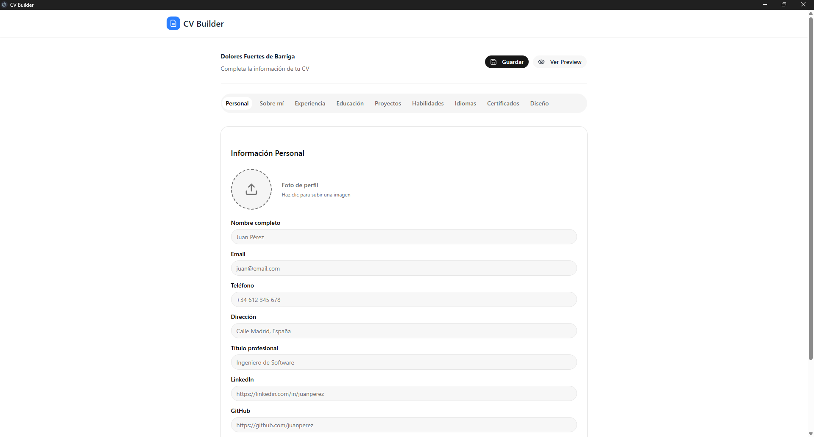

# CV Builder

Una aplicación de escritorio para crear y gestionar currículums vitae profesionales con una interfaz intuitiva y exportación a PDF.

## Características

- 💾 **Almacenamiento Local**: Tus datos se guardan localmente en tu dispositivo
- 📄 **Exportación a PDF**: Exporta tu CV en formato PDF
- 🖼️ **Previsualización en Vivo**: Ve cómo se ve tu CV antes de exportarlo
- 📱 **Responsive**: Funciona bien en diferentes tamaños de pantalla
- ⚡ **Rápido**: Aplicación de escritorio construida con Electron

## Tecnologías

- **Frontend**: React, TypeScript, TailwindCSS
- **Backend**: Electron para escritorio
- **Librerías**:
  - react-hook-form para manejo de formularios
  - zod para validación
  - Zustand para manejo de estado
  - jspdf y html2canvas para exportación a PDF

## Instalación

### Prerrequisitos

- Node.js >= 24.11.1
- npm o yarn

### Desarrollo

1. Clona el repositorio:
```bash
git clone <url-del-repositorio>
cd cv_builder
```

2. Instala las dependencias:
```bash
npm install
```

3. Inicia la aplicación en modo desarrollo:
```bash
npm run electron:dev
```

### Construcción

Para crear una versión de producción:

```bash
npm run build
```

Esto generará instaladores para Windows en la carpeta `release`.

## Uso

1. Abre la aplicación
2. Crea un nuevo CV o abre uno existente
3. Completa tu información personal en la sección "Personal"
4. Añade tu resumen profesional
5. Ingresa tu experiencia laboral
6. Agrega tu educación
7. Incluye proyectos relevantes
8. Lista tus habilidades técnicas y blandas
9. Añade idiomas que domines
10. Previsualiza tu CV
11. Exporta a PDF cuando estés satisfecho

## Notas
- En la ruta ``` C:\Users\[usuario]\AppData\Roaming\cv_builder\projectsCV en windows se guardan los proyectos (.json).```
- Este software esta hecho con vibecoding.
- Solo soporta un estilo de CV.

## Estructura del Proyecto

```
src/
├── backend/          # Lógica del lado del servidor
├── electron/         # Configuración de Electron
├── frontend/         # Código de la interfaz de usuario
│   ├── components/   # Componentes reutilizables
│   ├── features/     # Funcionalidades principales
│   ├── lib/          # Librerías auxiliares
│   ├── shared/       # Código compartido
│   └── store/        # Manejo de estado
└── types/            # Definiciones de tipos TypeScript (para el backend)
```
## Screenshot


